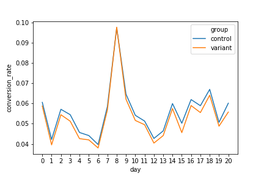
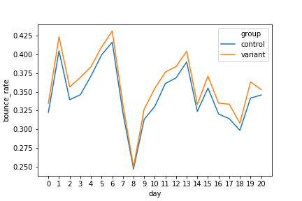
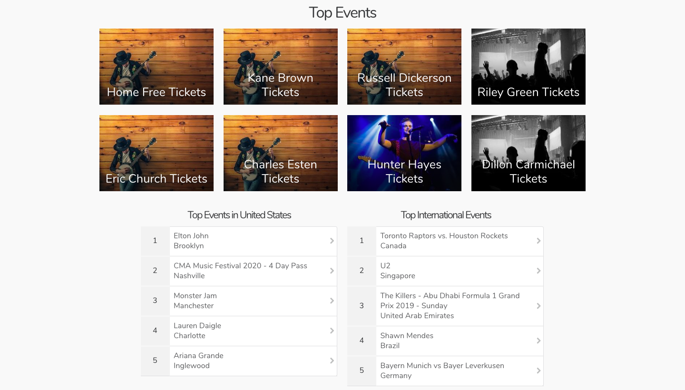
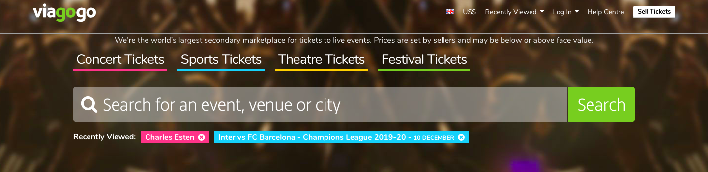

# viagogo product case study

by: Jonathan Batscha, candidate for Product Analyst

# Part 1

## Conversion Rate

$ConversionRate_{control} = .056$

$ConversionRate_{variant} = .053$

#### Difference

$ConversionRate_{variant} - ConversionRate_{control} = -.0025$

#### Ratio

$\frac{ConversionRate_{variant}}{ConversionRate_{control}} = .95$

#### Line Plot

#### statistical significance

Using a `chi-squared test`, we find that the $pvalue \approx 0$, indicating that *on aggregate*, the differences in conversion rate between the control and variant above are statistically significant.

*NOTE: this entire report uses $alpha = .05$ as the threshold for determining statistical signifiance of a given $pvalue$*

## Bounce Rate

$BounceRate_{control} = .34$

$BounceRate_{variant} = .36$

#### Difference

$BounceRate_{variant} - BounceRate_{control} = .015$

#### Ratio

$\frac{BounceRate_{variant}}{BounceRate_{control}} = 1.04$

#### Line Plot

#### statistical significance

Using a `chi-squared test`, we find that the $pvalue \approx 0$, indicating that *on aggregate*, the differences in bounce rate between the control and variant above are statistically significant.

## Supplementary Analysis

The numbers above treat the control and variant groups on aggregate; however, there is value in splitting up those 2 groups into various subsets according to:

1) whether user is new

2) whether user landed on homepage vs navigated to page from elsewhere on site

3) through which marketing channel user arrived

The rationale behind splitting these observations into user subsets is that one treatment may be more effective for new users, while the opposite treatment may be more effective for existing users. The data mostly confirms this.

The chart below shows the conversion rate and and bounce rate for each subset of users (new vs. existing, land vs. navigate, channel type), along with corresponding pvalues:

<table border="1" class="dataframe">  <thead>    <tr style="text-align: right;">      <th></th>      <th>new_user</th>      <th>land</th>      <th>channel</th>      <th>conv_rate ratio (variant/control)</th>      <th>conv_pvalue</th>      <th>bounce_rate ratio (variant/control)</th>      <th>bounce_pvalue</th>    </tr>  </thead>  <tbody>    <tr>      <th>0</th>      <td>0</td>      <td>0</td>      <td>Affiliate</td>      <td>1.044200</td>      <td>8.725576e-02</td>      <td>-</td>      <td>-</td>    </tr>    <tr>      <th>1</th>      <td>0</td>      <td>0</td>      <td>Direct</td>      <td>0.923416</td>      <td>2.237711e-05</td>      <td>-</td>      <td>-</td>    </tr>    <tr>      <th>2</th>      <td>0</td>      <td>0</td>      <td>Email</td>      <td>0.950100</td>      <td>1.365877e-01</td>      <td>-</td>      <td>-</td>    </tr>    <tr>      <th>3</th>      <td>0</td>      <td>0</td>      <td>Paid Search</td>      <td>0.957468</td>      <td>1.669638e-01</td>      <td>-</td>      <td>-</td>    </tr>    <tr>      <th>4</th>      <td>0</td>      <td>0</td>      <td>SEO</td>      <td>0.966234</td>      <td>1.429692e-01</td>      <td>-</td>      <td>-</td>    </tr>    <tr>      <th>5</th>      <td>0</td>      <td>0</td>      <td>Social Media</td>      <td>0.950775</td>      <td>1.826116e-01</td>      <td>-</td>      <td>-</td>    </tr>    <tr>      <th>6</th>      <td>1</td>      <td>0</td>      <td>Affiliate</td>      <td>0.977987</td>      <td>3.533897e-01</td>      <td>-</td>      <td>-</td>    </tr>    <tr>      <th>7</th>      <td>1</td>      <td>0</td>      <td>Direct</td>      <td>0.947334</td>      <td>9.395473e-04</td>      <td>-</td>      <td>-</td>    </tr>    <tr>      <th>8</th>      <td>1</td>      <td>0</td>      <td>Email</td>      <td>0.965764</td>      <td>3.587866e-01</td>      <td>-</td>      <td>-</td>    </tr>    <tr>      <th>9</th>      <td>1</td>      <td>0</td>      <td>Paid Search</td>      <td>0.988299</td>      <td>6.996750e-01</td>      <td>-</td>      <td>-</td>    </tr>    <tr>      <th>10</th>      <td>1</td>      <td>0</td>      <td>SEO</td>      <td>0.944070</td>      <td>4.490929e-03</td>      <td>-</td>      <td>-</td>    </tr>    <tr>      <th>11</th>      <td>1</td>      <td>0</td>      <td>Social Media</td>      <td>1.050713</td>      <td>2.570289e-01</td>      <td>-</td>      <td>-</td>    </tr>    <tr>      <th>12</th>      <td>0</td>      <td>1</td>      <td>Affiliate</td>      <td>0.920976</td>      <td>2.677102e-08</td>      <td>1.02758</td>      <td>6.56885e-11</td>    </tr>    <tr>      <th>13</th>      <td>0</td>      <td>1</td>      <td>Direct</td>      <td>0.932118</td>      <td>2.188615e-13</td>      <td>1.06264</td>      <td>6.72296e-112</td>    </tr>    <tr>      <th>14</th>      <td>0</td>      <td>1</td>      <td>Email</td>      <td>0.943150</td>      <td>7.038769e-03</td>      <td>1.05008</td>      <td>3.19279e-13</td>    </tr>    <tr>      <th>15</th>      <td>0</td>      <td>1</td>      <td>Paid Search</td>      <td>0.870167</td>      <td>1.481293e-14</td>      <td>1.03137</td>      <td>3.14846e-09</td>    </tr>    <tr>      <th>16</th>      <td>0</td>      <td>1</td>      <td>SEO</td>      <td>0.925030</td>      <td>5.438949e-10</td>      <td>1.01697</td>      <td>9.68093e-07</td>    </tr>    <tr>      <th>17</th>      <td>0</td>      <td>1</td>      <td>Social Media</td>      <td>1.025623</td>      <td>2.857426e-01</td>      <td>1.07896</td>      <td>5.75997e-24</td>    </tr>    <tr>      <th>18</th>      <td>1</td>      <td>1</td>      <td>Affiliate</td>      <td>1.033099</td>      <td>6.761827e-03</td>      <td>1.01977</td>      <td>3.33617e-09</td>    </tr>    <tr>      <th>19</th>      <td>1</td>      <td>1</td>      <td>Direct</td>      <td>0.943457</td>      <td>2.208568e-12</td>      <td>1.04781</td>      <td>8.349e-95</td>    </tr>    <tr>      <th>20</th>      <td>1</td>      <td>1</td>      <td>Email</td>      <td>0.939848</td>      <td>1.407659e-03</td>      <td>1.0339</td>      <td>1.2157e-10</td>    </tr>    <tr>      <th>21</th>      <td>1</td>      <td>1</td>      <td>Paid Search</td>      <td>1.013970</td>      <td>3.821198e-01</td>      <td>1.04191</td>      <td>2.22148e-23</td>    </tr>    <tr>      <th>22</th>      <td>1</td>      <td>1</td>      <td>SEO</td>      <td>0.968388</td>      <td>2.079523e-03</td>      <td>1.05095</td>      <td>2.33611e-70</td>    </tr>    <tr>      <th>23</th>      <td>1</td>      <td>1</td>      <td>Social Media</td>      <td>0.990628</td>      <td>6.683569e-01</td>      <td>0.980478</td>      <td>0.00132746</td>    </tr>  </tbody></table>

## Recommendations

We can split the subsets into the following groups, depending on whether they see better conversion rate, bounce rate, or both, under variant or control treatment, with sufficient confidence.

### subsets for which control shows both better conversion rate and bounce rate (if applicable), at a statistically significant level

For the following subsets of users, I recommend we revert to the control treatment:

<table border="1" class="dataframe">  <thead>    <tr style="text-align: right;">      <th></th>      <th>new_user</th>      <th>land</th>      <th>channel</th>      <th>conv_rate ratio (variant/control)</th>      <th>conv_pvalue</th>      <th>bounce_rate ratio (variant/control)</th>      <th>bounce_pvalue</th>    </tr>  </thead>  <tbody>    <tr>      <th>1</th>      <td>0</td>      <td>0</td>      <td>Direct</td>      <td>0.923416</td>      <td>2.237711e-05</td>      <td>-</td>      <td>-</td>    </tr>    <tr>      <th>7</th>      <td>1</td>      <td>0</td>      <td>Direct</td>      <td>0.947334</td>      <td>9.395473e-04</td>      <td>-</td>      <td>-</td>    </tr>    <tr>      <th>10</th>      <td>1</td>      <td>0</td>      <td>SEO</td>      <td>0.944070</td>      <td>4.490929e-03</td>      <td>-</td>      <td>-</td>    </tr>    <tr>      <th>12</th>      <td>0</td>      <td>1</td>      <td>Affiliate</td>      <td>0.920976</td>      <td>2.677102e-08</td>      <td>1.02758</td>      <td>6.56885e-11</td>    </tr>    <tr>      <th>13</th>      <td>0</td>      <td>1</td>      <td>Direct</td>      <td>0.932118</td>      <td>2.188615e-13</td>      <td>1.06264</td>      <td>6.72296e-112</td>    </tr>    <tr>      <th>14</th>      <td>0</td>      <td>1</td>      <td>Email</td>      <td>0.943150</td>      <td>7.038769e-03</td>      <td>1.05008</td>      <td>3.19279e-13</td>    </tr>    <tr>      <th>15</th>      <td>0</td>      <td>1</td>      <td>Paid Search</td>      <td>0.870167</td>      <td>1.481293e-14</td>      <td>1.03137</td>      <td>3.14846e-09</td>    </tr>    <tr>      <th>16</th>      <td>0</td>      <td>1</td>      <td>SEO</td>      <td>0.925030</td>      <td>5.438949e-10</td>      <td>1.01697</td>      <td>9.68093e-07</td>    </tr>    <tr>      <th>19</th>      <td>1</td>      <td>1</td>      <td>Direct</td>      <td>0.943457</td>      <td>2.208568e-12</td>      <td>1.04781</td>      <td>8.349e-95</td>    </tr>    <tr>      <th>20</th>      <td>1</td>      <td>1</td>      <td>Email</td>      <td>0.939848</td>      <td>1.407659e-03</td>      <td>1.0339</td>      <td>1.2157e-10</td>    </tr>    <tr>      <th>22</th>      <td>1</td>      <td>1</td>      <td>SEO</td>      <td>0.968388</td>      <td>2.079523e-03</td>      <td>1.05095</td>      <td>2.33611e-70</td>    </tr>  </tbody></table>

### subsets for which variant shows both better conversion rate and bounce rate (if applicable), at a statistically significant level 

No such subsets of users

### subsets for which control shows significantly better conversion rate, but bounce rate is worse/inconclusive

No such subsets of users

### subsets for which variant shows significantly better conversion rate, but bounce rate is worse/inconclusive

For the following subset of users, I recommend switching to the variant treatment, though it is worth thinking about the tradeoff between improving conversion rate at the expense of worsening bounce rate

<table border="1" class="dataframe">  <thead>    <tr style="text-align: right;">      <th></th>      <th>new_user</th>      <th>land</th>      <th>channel</th>      <th>conv_rate ratio (variant/control)</th>      <th>conv_pvalue</th>      <th>bounce_rate ratio (variant/control)</th>      <th>bounce_pvalue</th>    </tr>  </thead>  <tbody>    <tr>      <th>18</th>      <td>1</td>      <td>1</td>      <td>Affiliate</td>      <td>1.033099</td>      <td>0.006762</td>      <td>1.019774</td>      <td>3.336166e-09</td>    </tr>  </tbody></table>

### subsets for which impact on conversion rate is inconclusive

For the following data, I recommend continuing the A/B test until we see more statistically significant results

<table border="1" class="dataframe">  <thead>    <tr style="text-align: right;">      <th></th>      <th>new_user</th>      <th>land</th>      <th>channel</th>      <th>conv_rate ratio (variant/control)</th>      <th>conv_pvalue</th>      <th>bounce_rate ratio (variant/control)</th>      <th>bounce_pvalue</th>    </tr>  </thead>  <tbody>    <tr>      <th>0</th>      <td>0</td>      <td>0</td>      <td>Affiliate</td>      <td>1.044200</td>      <td>0.087256</td>      <td>-</td>      <td>-</td>    </tr>    <tr>      <th>2</th>      <td>0</td>      <td>0</td>      <td>Email</td>      <td>0.950100</td>      <td>0.136588</td>      <td>-</td>      <td>-</td>    </tr>    <tr>      <th>3</th>      <td>0</td>      <td>0</td>      <td>Paid Search</td>      <td>0.957468</td>      <td>0.166964</td>      <td>-</td>      <td>-</td>    </tr>    <tr>      <th>4</th>      <td>0</td>      <td>0</td>      <td>SEO</td>      <td>0.966234</td>      <td>0.142969</td>      <td>-</td>      <td>-</td>    </tr>    <tr>      <th>5</th>      <td>0</td>      <td>0</td>      <td>Social Media</td>      <td>0.950775</td>      <td>0.182612</td>      <td>-</td>      <td>-</td>    </tr>    <tr>      <th>6</th>      <td>1</td>      <td>0</td>      <td>Affiliate</td>      <td>0.977987</td>      <td>0.353390</td>      <td>-</td>      <td>-</td>    </tr>    <tr>      <th>8</th>      <td>1</td>      <td>0</td>      <td>Email</td>      <td>0.965764</td>      <td>0.358787</td>      <td>-</td>      <td>-</td>    </tr>    <tr>      <th>9</th>      <td>1</td>      <td>0</td>      <td>Paid Search</td>      <td>0.988299</td>      <td>0.699675</td>      <td>-</td>      <td>-</td>    </tr>    <tr>      <th>11</th>      <td>1</td>      <td>0</td>      <td>Social Media</td>      <td>1.050713</td>      <td>0.257029</td>      <td>-</td>      <td>-</td>    </tr>    <tr>      <th>17</th>      <td>0</td>      <td>1</td>      <td>Social Media</td>      <td>1.025623</td>      <td>0.285743</td>      <td>1.07896</td>      <td>5.75997e-24</td>    </tr>    <tr>      <th>21</th>      <td>1</td>      <td>1</td>      <td>Paid Search</td>      <td>1.013970</td>      <td>0.382120</td>      <td>1.04191</td>      <td>2.22148e-23</td>    </tr>    <tr>      <th>23</th>      <td>1</td>      <td>1</td>      <td>Social Media</td>      <td>0.990628</td>      <td>0.668357</td>      <td>0.980478</td>      <td>0.00132746</td>    </tr>  </tbody></table>

# Part 2

## potential improvements to current page 

#### 1) Enforce unique images for top events

On the current page, I see the following "Top Events":

I theorize that the duplicate images we see for some events may be offputting to users who may otherwise be enticed into exploring events (and later purchasing tickets). One remedy could be to have a larger variety of stock images for different concert types (country, football, EDM, etc), such that there is no need to have duplicate images appear on the current page.

#### 2) Tailor top events to user's specific metropolitan area / demographic profile / interests

The current page shows me "Top Events" all over the USA, as well as in other countries. That seems off to me. The rationale here is that there is a limit to how many recommendations you can show a given user, and it makes sense to prioritize events that they are most likely to attend. The possibility that a given user attends a given event likely drops off as the distance from the event grows. Hence, closer events should be prioritized.

We can further extend this idea as follows:

A user's interest in a given event is likely to be:

- negatively correlated with distance (from event to user)
- positively correlated with event's popularity

We can find a regression that accurately describes this relationship, to show users local events (both big and small), along with larger events in neighboring states/countries, that they are most likely to be interested in.

Additionally, there is likely to be a cultural/linguistic component that complicates basing the model above on pure geographic distance. For example:

- users in Germany may prefer events in Austria to events in France
- users in the UK may be more interested in events in Australia than are users in Spain
- users with a phone that is most common in India may be more interested in a cricket game than users with a phone that is most common in China

This cultural/linguistic component is likely to be strongest for Theatre/Comedy events and weakest for Sports events, with music falling somewhere in the middle.

Lastly, judging from my front page recommendations, I think viagogo can do a more accurate job leveraging cookies to serve more relevant recommendations to users.

#### 3) Experiment with different banner images

On the current page, I see the following banner:

While I am no expert in graphic design, it strikes me as busy and not eye-catching. I would like to A/B test different banner designs, particularly solid colors, gradients, and simple geometric designs, to see if more inviting designs can translate to demonstrably higher search activity and conversion rates.

#### 4) Experiment with description in banner

In the banner image above, I currently see the following text:

Perhaps the following would be more inviting: moving the disclaimer to the footer of the page, and replacing the current banner text with a simpler phrase, e.g:

   ***Buy / Sell Tickets***

#### 5) Experiment with an additional ***BEST DEALS*** category in banner

The current banner features the following ticket categories:

I would be curious to see how users respond to an additional category labelled ***BEST DEALS***, which would highlight tickets across any category that our models indicate are selling at a great value.

The rationale here is that certain users may be more interested in seeing something new and interesting, as opposed to attending a specific type of event. Further, my personal experience shopping, both for myself and with others, tells me that people love getting a deal, and are willing to buy something they were not otherwise planning on buying, if they are suffificiently convinced that they are getting a great deal. This is the entire rationale behind "Black Friday Sales", and I believe could result in an increase in sales, particularly among more price-sensitive users.

### Additional data to prioritize the above ideas

It seems to me the highest leverage idea is to focus on a user's location, demographics, and interests, as gathered from cookies/metadata; however, for that, I'd like to know for which percentage of users does viagogo have access to such data, and at what granularity. Additionally, I'd be curious to see a regression on how relevant an event is for a user, given an event's popularity and distance. Specifically, maybe users in France would be interested in a huge event in Spain, but not a similarly huge even in NYC.

I'd also be interested in experimenting with a simpler banner image, and would like to look into some behavioral psychology to help guide the choices for the different treatment groups in that experiment.

Lastly, I'd be interested in seeing how we could use cookies to better target event recommendations to user interests, beyond geographic data. For example:
- a user searching for guitar chords may be better served by being recommended rock/country shows than EDM festivals
- a user who previously watched a standup special on Netflix may be better served by being recommended Comedy events
- a user who frequents sports gambling sites may be better served by sports event recommendations
- the list goes on...

### Quantifying success/failure for above experiments

I think a reasonable approach to tackle each of the above ideas is to run A/B tests, evaluated using the same chi-square methodology I applied to part 1 of this case study.

However, one difference I would look into is in how users are broken up into subsets. For example:

- in recommending international events, it may be worth taking into account a user's language if recommending a Theatre/Comedy show, whereas such data may be less important for recommending a sports event
- look into using cookies to split up users into broad categories based on interest / demographics, to serve more useful recommendations
- grouping users by age may need to be different between a professional sports event vs a college sports event (as students may get discounts for college games, and in such case, there is a big difference between 20 and 23 in predicting whether a user is a student)
